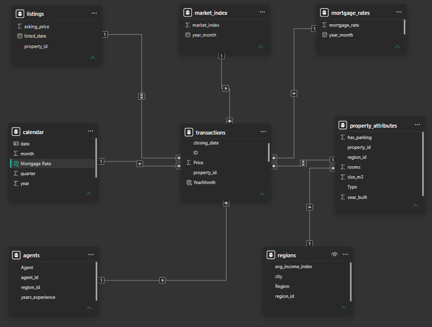
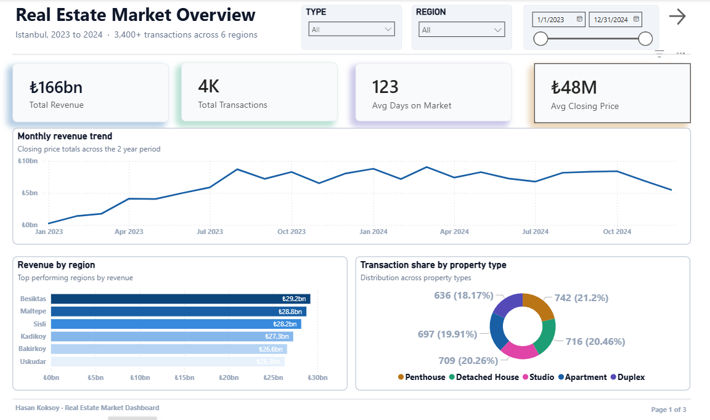
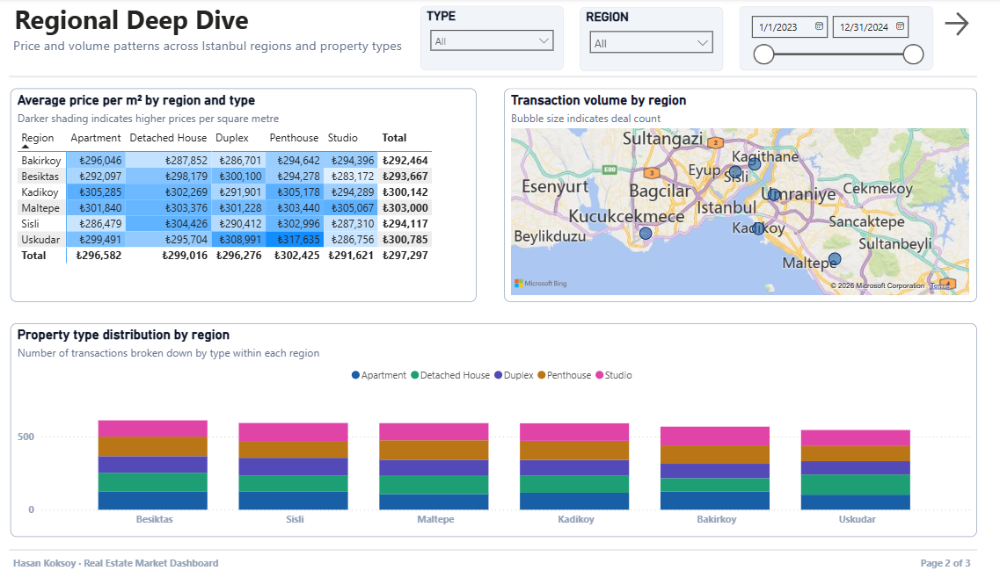
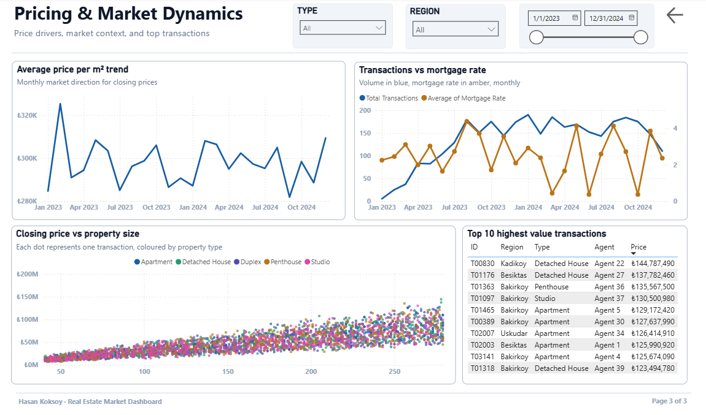

# Real Estate Market Power BI Dashboard

An executive Power BI dashboard built on top of an 8-source real estate ETL
pipeline. Three pages cover the full analytical story: market overview,
regional deep dive, and pricing dynamics with macro context.

Built to mirror the kind of reporting layer that sits on top of a real
data warehouse in a real estate brokerage, where executives need to see
revenue, transactions, regional performance, and pricing trends in one
place.

## What this dashboard answers

**Page 1, Executive Overview** answers how the market is doing overall.
Total revenue, transaction count, average closing price, days on market,
plus monthly trend and region/property type breakdowns.

**Page 2, Regional Deep Dive** answers which regions and property types
lead. Average price per m² matrix by region and type, transaction volume
map, property type distribution by region.

**Page 3, Pricing and Market Dynamics** answers what drives pricing.
Closing price vs property size scatter, transactions vs mortgage rate
trend, average price per m² over time, and the top 10 highest-value
transactions.

## Data model

The dashboard runs on a star schema with one fact table (transactions)
and seven dimension tables connected by foreign keys.

Fact table: **transactions** (3,446 closed deals across 2 years)

Dimensions:
- **property_attributes** (property_id, size, rooms, year built)
- **listings** (property_id, listed_date, asking_price)
- **agents** (agent_id, region, experience)
- **regions** (region_id, region_name, avg income index)
- **calendar** (date, year, month, quarter)
- **market_index** (year_month, monthly market index)
- **mortgage_rates** (year_month, monthly mortgage rate)

Full data model documentation is in [measures/data_model.md](measures/data_model.md).

## DAX measures

Eight custom measures power the visuals, ranging from simple aggregations
to time intelligence and cross-table calculations using RELATED.

Full DAX documentation is in [measures/dax_measures.md](measures/dax_measures.md).

## Page previews

### Page 1, Executive Overview

### Page 2, Regional Deep Dive

### Page 3, Pricing and Market Dynamics

## How to open

1. Clone the repo
2. Open `RealEstateMarketDashboard.pbix` in Power BI Desktop
3. The 8 source CSVs in `data/` are wired into the model already
4. If data sources need to be refreshed, point them to the local `data/` folder

## Tools

Power BI Desktop, DAX, Power Query, star schema modeling

## Notes on the data

The CSVs in `data/` are synthetic, generated to mimic the shape of real
Istanbul real estate data. The pricing logic does not encode strong type
or region premiums, so absolute prices should not be read as
representative of the actual Istanbul market. The dashboard's value is in
the analytical structure and modeling approach, not the specific numbers.

## Related projects

This dashboard is the BI layer of a complete data pipeline. The ETL that
produces this data is in [real-estate-etl](https://github.com/HasanKoks/real-estate-etl).
